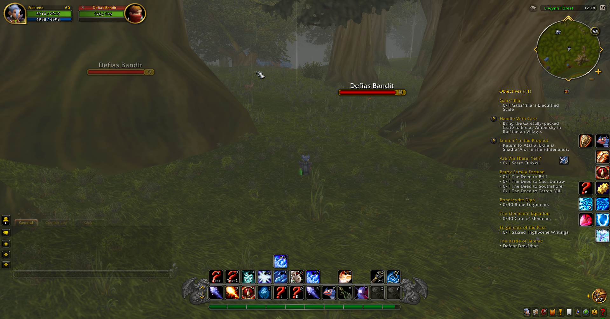

# Retail UI (Beta)

Retail UI ported to the old version of the client (3.3.5a).

## Features

- Action Bars
- Unit Frames
- Map
- Cast Bar
- Grid Layout to adjust the possition of UI elements

## Quick Start

Type ``/dfui edit`` for open addon's grid layout.

Type ``/dfui default`` for reset addon's settings.

## Support

If you found are bugs please use Issues or Pull request your fixes.