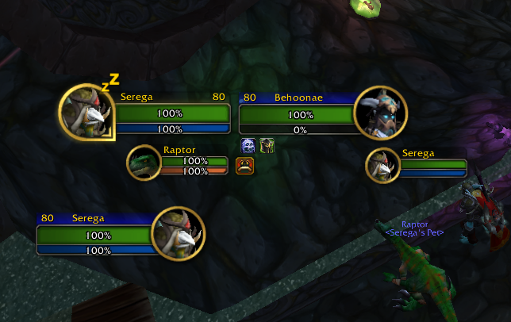
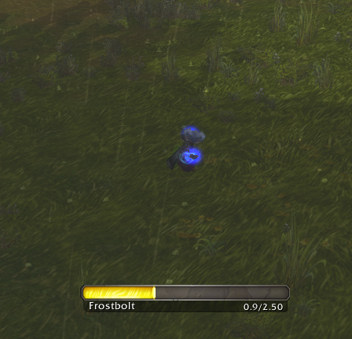
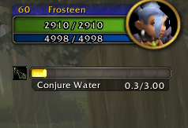
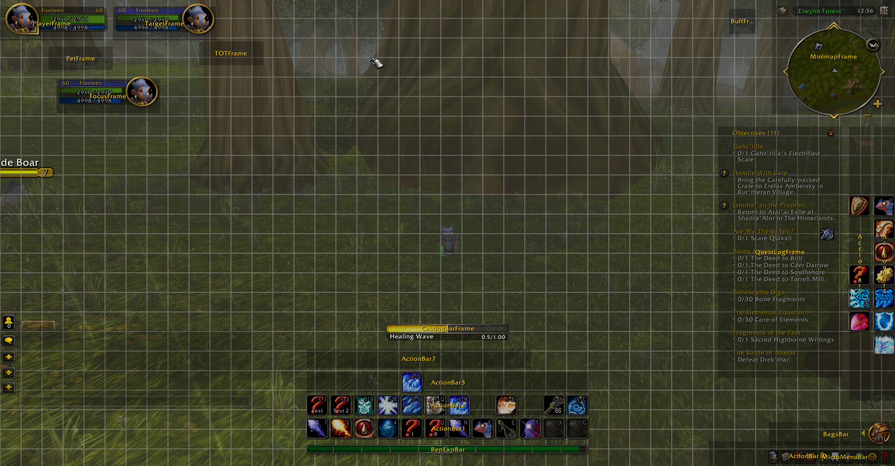
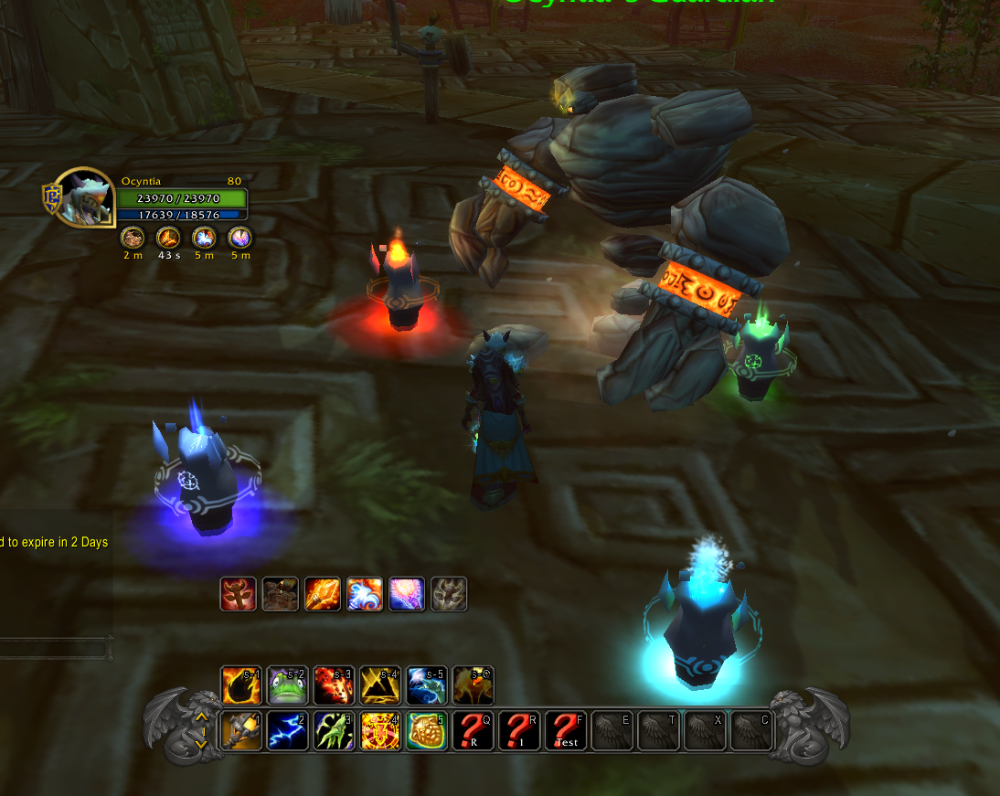
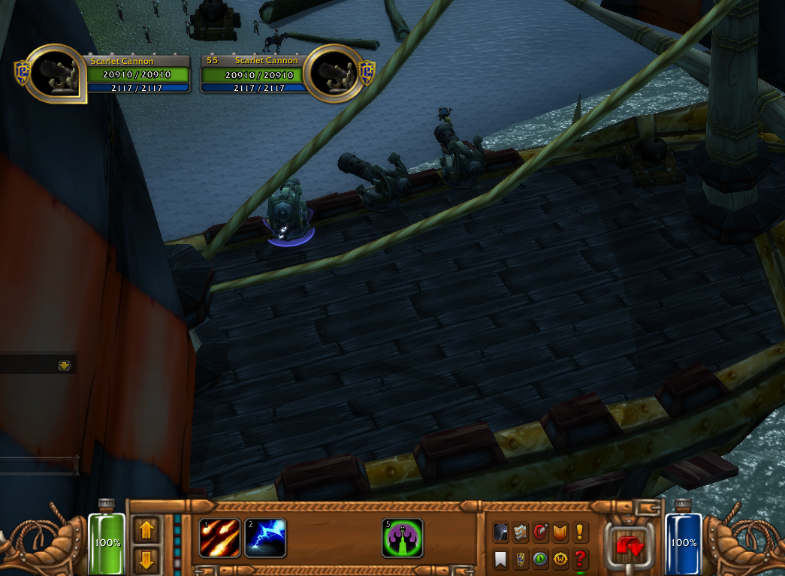

# Retail UI

  

UI inspired by the Retail version. This addon retextures the existing interface.

## Features

- Action Bars
- Unit Frames
- Minimap
- Casting Bars
- Vehicle UI
- Grid Layout to adjust the possition of UI elements

## Quick Start

Type ``/dfui edit`` for open grid layout.

Type ``/dfui default`` for reset settings.

## Screenshots

## Contributing

If you are interested in improving this addon, please pull request your changes. 
When making a pull request, please adhere to the style and structure of the source code.
